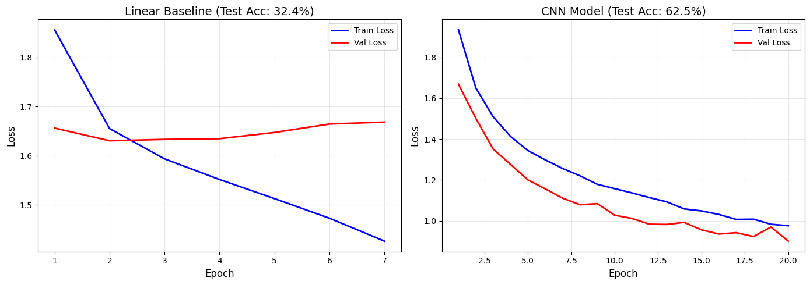
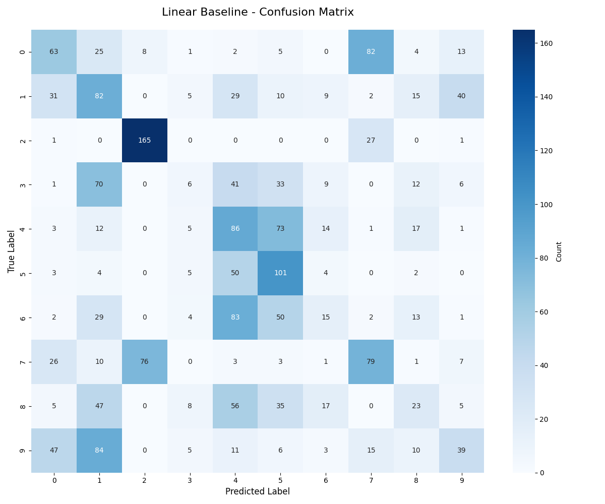
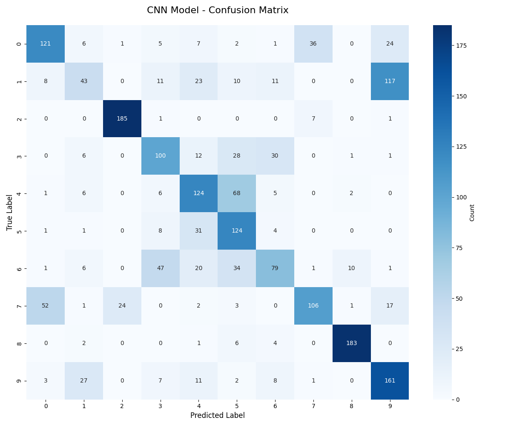

# Microbial DNA CNN Classifier

# Project Overview
Deep learning pipeline for classifying microbial species from DNA sequencing reads using PyTorch.

# Dataset (randomly selected 10 species from NCBI):
- 20,000 DNA sequences (300bp each)
- 10 bacterial species

# Task: Multi-class classification of species from raw DNA sequences
Approach
## 1. Data Preprocessing
   
- One-hot encoding of DNA sequences (A/C/G/T/N → 5-channel representation)
- Train/validation/test split (80/10/10)
- **PyTorch** DataLoader for efficient batch processing

## 2. Model Architectures
Baseline: Linear Classifier
- Flattened sequence → 128-unit hidden layer → 10-class output
- **Training**: Adam optimizer (lr=0.001), dropout=0.5, weight_decay=1e-4

## 3. Main Model: Convolutional Neural Network
[TODO]

## 4. Training Strategy
Loss: Cross-entropy loss
Optimizer: Adam (lr=0.001)
Early stopping (patience=5 epochs)

## 5. Evaluation
- Training/validation loss curves
- [TODO]: Per-class precision, recall, F1-score
- [TODO]:Confusion matrix analysis

## Results

### Linear Baseline
- **Accuracy**: ~32%

### Main Model: Convolutional Neural Network
- **Accuracy**: ~63%

### Model Evaluation

MODEL COMPARISON SUMMARY

Linear Baseline Test Accuracy: 32.95% 

CNN Model Test Accuracy:       61.30%

Improvement:                   +28.35%

Linear Macro-Average F1:       0.301

CNN Macro-Average F1:          0.605

Improvement:                   +0.305

NN achieves 61.3% accuracy vs 33.0% for linear baseline - nearly 2x improvement. Macro F1-score improved from 0.30 to 0.61 which is a substantial in per-class performance. This demonstrates that convolutional layers successfully captured DNA sequence patterns that the linear baseline did not.
However, 61% accuracy indicates significant room for improvement through, which I can approach via:
- Deeper architectures (add more conv layers)
- Hyperparameter tuning (learning rate, kernel sizes, filters)
- Longer training (more epochs)?

