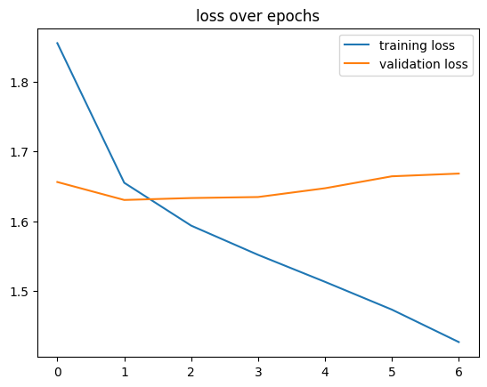

# microbial-dna-classifier

Project Overview
Deep learning pipeline for classifying microbial species from DNA sequencing reads using PyTorch.

Dataset (randomly selected 10 species from NCBI):
- 20,000 DNA sequences (300bp each)
- 10 bacterial species

Task: Multi-class classification of species from raw DNA sequences
Approach
1. Data Preprocessing
   
- One-hot encoding of DNA sequences (A/C/G/T/N → 5-channel representation)
- Train/validation/test split (80/10/10)
- PyTorch DataLoader for efficient batch processing

3. Model Architectures
Baseline: Linear Classifier
- Flattened sequence → 128-unit hidden layer → 10-class output
- **Training**: Adam optimizer (lr=0.001), dropout=0.5, weight_decay=1e-4

4. Main Model: Convolutional Neural Network
[TODO]

5. Training Strategy
Loss: Cross-entropy loss
Optimizer: Adam (lr=0.001)
Early stopping (patience=5 epochs)

6. Evaluation
- Training/validation loss curves
- [TODO]: Per-class precision, recall, F1-score
- [TODO]:Confusion matrix analysis

## Results

### Linear Baseline
- **Accuracy**: ~40%

### Next Steps
- Implement CNN
